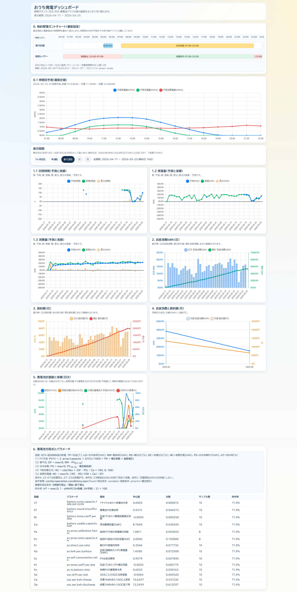

# Solar Controller Automation（説明文・日本語）

太陽光発電＋蓄電池の運用を自動化するPythonプロジェクトです。  
毎日 **23:00 / 03:10 / 07:00（JST）** に、翌日の予報情報と稼働CSVをもとに蓄電池設定を調整します。

## できること

- 予報データ（翌日の日照時間）取得
- モニタリングサービスへのログインとCSV取得
- 稼働実績と予報に基づく夜間充電計画の計算
- 蓄電池設定（夜間グリーン設定 / 日中グリーン設定）の自動更新
- 03系ジョブで予報再取得と必要充電量の再見積もりを行い、必要時のみ夜間設定を微調整
- ダッシュボード表示（予測 vs 実績、1時間ごとの予測、自家消費kWh、節約額、月次推移、蓄電池設定と実績、方程式とパラメータ）
- 運用条件ファイル（`fixed/variable/priority`）による制約管理

## 特徴

- ローカル実行とクラウド実行（Cloud Run Jobs + Cloud Scheduler）に対応
- データはFirestore/SQLite/PostgreSQLバックエンドを切替可能
- リプレイモード・再現スクリプト・週次差分バックアップを同梱
- 公開リポジトリ向けに機密情報を除外（`.env` / 実データ / 認証情報は含めない）
- ダッシュボードは初期表示を全期間にし、「1ヶ月(日) / 年(週) / 全て(日)」の期間ボタンと「前 / 後」ボタンで、全グラフの表示範囲を連動して切り替える構成
- 年表示だけは日次ではなく週次に集計し、長期表示でも読みやすい粒度に調整
- 集計月は前月15日から当月14日を当月分として扱い、締め日は `DASHBOARD_AGGREGATION_CLOSE_DAY` で変更可能

## ダッシュボード例

- 最新計画の1時間ごとの予想発電量・予想充電量・予想消費電量を折れ線グラフで表示
- 日照時間、発電量、消費量は予測・実績・差分を表示
- 自家消費kWh（日）と節約額（日）は別グラフに分離
- 日次値（棒）と累計値（折れ線）を別軸で表示し、軸色を系列色に合わせて可読性を向上
- 蓄電池設定と実績は `kWh` 軸と `%` 軸を分離して表示
- 条件管理（固定条件/変動条件/優先順位）を方程式セクションに明示
- スマホ表示では縦並びレイアウトで閲覧しやすく最適化

## Google Cloud運用前提の説明

- [docs/GCP_OPERATION_JA.md](GCP_OPERATION_JA.md)
