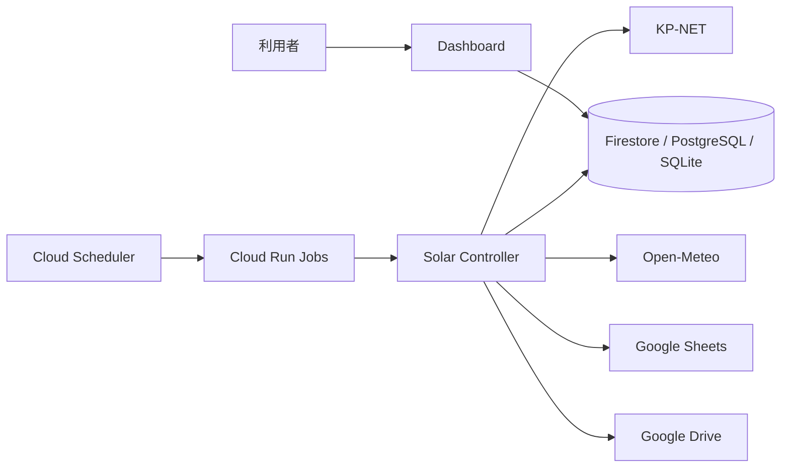

# System Context

## 対象

Solar Controller は、家庭の太陽光発電と蓄電池の運用を自動化するシステムです。

| 関係先 | 役割 | 主な入出力 |
| --- | --- | --- |
| KP-NET | 蓄電池の監視・設定 | CSV、設定プロファイル |
| Open-Meteo | 気象予報 | 時間別気象・日射関連データ |
| Firestore / PostgreSQL / SQLite | 永続化 | 実績、計画、設定イベント、集計値 |
| Google Sheets | 任意の運用出力 | 集計・運用向けデータ |
| Google Drive | 復旧用バックアップ | データスナップショット |
| Dashboard | 利用者の確認画面 | 予測、実績、設定、警告 |

## 境界

- 外部サービスの応答形式はアダプタ層で扱い、エネルギー計画の規則へ直接持ち込まない。
- `.env` と Secret Manager は認証情報・環境固有値を扱う。値を文書やソースへ記録しない。
- ダッシュボードは制御を行わず、保存済みの状態を読み取り・表示する。

次: [実行基盤とデプロイ](02-runtime-and-deployment.md)
