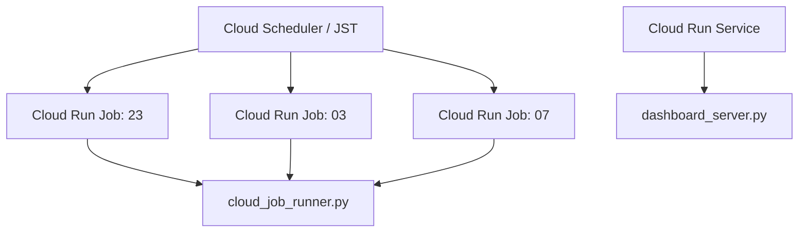

# Runtime and Deployment

## 実行コンテナ

デプロイ時刻の正本は `scripts/deploy_gcp_jobs.ps1` です。Scheduler は `0 23 * * *`、`0 3 * * *`、`0 7 * * *` を Asia/Tokyo で設定します。

| スロット | 責務 | 外部取得・保存 |
| --- | --- | --- |
| 23 | 蓄電池を待機モードへ寄せる | 外部取得・予測はしない |
| 03 | CSV・予報取得、計画再生成、必要時の強制充電、DB反映、任意のSheets/Drive出力 | このスロットに集約 |
| 07 | 日中向けグリーンモードへ切替 | 設定操作のみ |

## デプロイ境界

- Jobコンテナ: `Dockerfile`
- Dashboardコンテナ: `Dockerfile.dashboard`
- Dashboardビルド: `cloudbuild.dashboard.yaml`
- 本番操作の正本: `docs/current/ops/PRODUCTION_DEPLOYMENT_RUNBOOK_JA.md`

本番の変更・データ取込・バックアップは、個別のクラウドCLIではなくリポジトリのラッパースクリプトで実行します。

次: [コード責務表](03-code-map.md)
