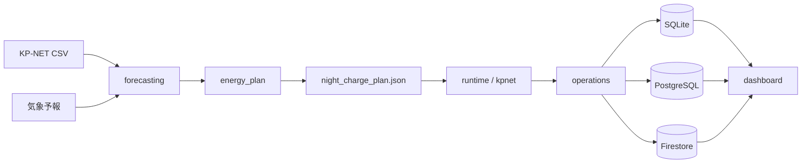

# Data and Backends

## 保存先の役割

| 種別 | 用途 | 設定 |
| --- | --- | --- |
| `artifacts/` | 実行ごとのCSV、計画、サマリーなどの生成物 | ローカルまたは一時領域 |
| SQLite | ローカル検証・簡易運用 | `DATA_BACKEND=sqlite` |
| PostgreSQL | 代替の本番永続化 | `DATA_BACKEND=postgres` |
| Firestore | 推奨する本番永続化 | `DATA_BACKEND=firestore` |
| Google Drive | 復旧用のバックアップ | Drive関連設定 |

## 共通契約

ダッシュボードは `DashboardQuerySnapshot` を共通の読み取り境界にし、バックエンド固有の行を表示用スライスへ変換します。バックエンドの実装を変更するときは、同じデータ範囲・欠損時の扱い・集計結果を維持してください。

詳細な運用条件は [GCP運用](../ops/GCP_OPERATION_JA.md) と [本番デプロイ手順](../ops/PRODUCTION_DEPLOYMENT_RUNBOOK_JA.md) を参照してください。

次: [入口一覧](05-entrypoints.md)
